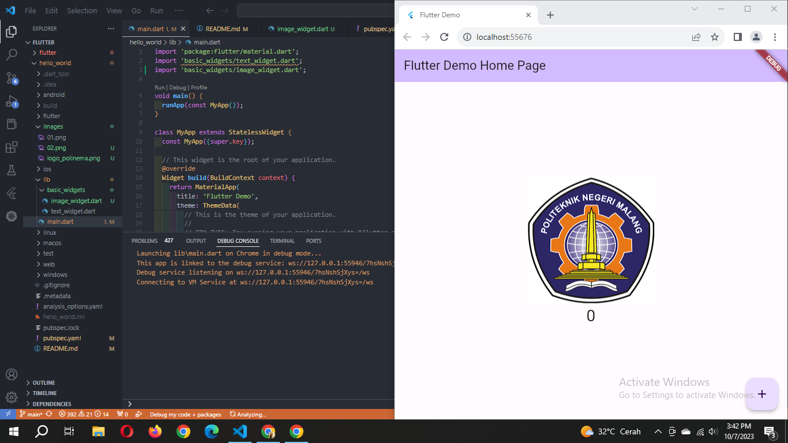

### Devi Andini Febrianti
### 2141720189/09 | D4TI-3H

# FLUTTER

#### Praktikum 1: Membuat Project Flutter Baru
'Berhasil'

#### Praktikum 2: Membuat Repository GitHub dan Laporan Praktikum
Link github: 
https://github.com/deviandinifebrianti/flutter-fundamental-part1 

Berikut ini adalah dokumentasi flutter yang telah berhasil di run di chrome.


#### Praktikum 3: Menerapkan Widget Dasar
##### Langkah 1: Text Widget
Buat folder baru basic_widgets di dalam folder lib. Kemudian buat file baru di dalam basic_widgets dengan nama text_widget.dart. Ketik atau salin kode program berikut ke project hello_world Anda pada file text_widget.dart.

```dart
import 'package:flutter/material.dart';

class MyTextWidget extends StatelessWidget {
  const MyTextWidget({Key? key}) : super(key: key);

  @override
  Widget build(BuildContext context) {
    return const Text(
      "Nama saya Devi, sedang belajar Pemrograman Mobile",
      style: TextStyle(color: Colors.red, fontSize: 14),
      textAlign: TextAlign.center);
  }
}
```
Diganti dengan nama kita sendiri "Devi Andini Febrianti"


##### Langkah 2: Image Widget
Buat sebuah file image_widget.dart di dalam folder basic_widgets dengan isi kode berikut.

``` dart
import 'package:flutter/material.dart';

class MyImageWidget extends StatelessWidget {
  const MyImageWidget({Key? key}) : super(key: key);

  @override
  Widget build(BuildContext context) {
    return const Image(
      image: AssetImage("images/logo_polinema.png")
    );
  }
}
```

Lakukan penyesuaian asset pada file pubspec.yaml dan tambahkan file logo Anda di folder assets project hello_world.
``` dart
flutter:
  assets:
     - logo_polinema.jpg
```
"Dokumentasi"


#### Praktikum 4: Menerapkan Widget Material Design dan iOS Cupertino
##### Langkah 1: Cupertino Button dan Loading Bar
Buat file di basic_widgets > loading_cupertino.dart. Import stateless widget dari material dan cupertino. Lalu isi kode di dalam method Widget build adalah sebagai berikut.

``` dart
import 'package:flutter/material.dart'; 
import 'package:flutter/cupertino.dart'; 
  
class LoadingCupertino extends StatelessWidget { 
  const LoadingCupertino({Key? key}) : super(key: key); 
  
  @override 
  Widget build(BuildContext context) { 
        return MaterialApp( 
        home: Container( 
            margin: const EdgeInsets.only(top: 30), 
            color: Colors.white, 
            child: Column( 
            children: <Widget>[ 
                CupertinoButton( 
                child: const Text("Contoh button"), 
                onPressed: () {}, 
                ), 
                const CupertinoActivityIndicator(), 
                ], 
            ), 
        ), 
    ); 
  } 
}
```

##### Langkah 2: Floating Action Button (FAB)
Button widget terdapat beberapa macam pada flutter yaitu ButtonBar, DropdownButton, TextButton, FloatingActionButton, IconButton, OutlineButton, PopupMenuButton, dan ElevatedButton.

Buat file di basic_widgets > fab_widget.dart. Import stateless widget dari material. Lalu isi kode di dalam method Widget build adalah sebagai berikut.

``` dart
import 'package:flutter/material.dart';
  
class FabWidget extends StatelessWidget { 
  const FabWidget({Key? key}) : super(key: key); 
  
  @override 
  Widget build(BuildContext context) { 
    return MaterialApp(
      home: Scaffold(
        floatingActionButton: FloatingActionButton(
          onPressed: () {
            // Add your onPressed code here!
          },
          child: const Icon(Icons.thumb_up),
          backgroundColor: Colors.pink,
        ),
      ),
    );
  } 
}
```

##### Langkah 3: Scaffold Widget
Scaffold widget digunakan untuk mengatur tata letak sesuai dengan material design.

-> berada di main
```dart
i
```

Perubahan di main seperti ini:

Berikut ini dokumentasi ketika di klik tanda + (maka akan bertambah dengan sendirinya)


#### Langkah 4: Dialog Widget

```dart
class MyApp extends StatelessWidget {
  const MyApp({Key? key}) : super(key: key);

  @override
  Widget build(BuildContext context) {
    return const MaterialApp(
      home: Scaffold(
        body: MyLayout(),
      ),
    );
  }
}

class MyLayout extends StatelessWidget {
  const MyLayout({Key? key}) : super(key: key);

  @override
  Widget build(BuildContext context) {
    return Padding(
      padding: const EdgeInsets.all(8.0),
      child: ElevatedButton(
        child: const Text('Show alert'),
        onPressed: () {
          showAlertDialog(context);
        },
      ),
    );
  }
}

showAlertDialog(BuildContext context) {
  // set up the button
  Widget okButton = TextButton(
    child: const Text("OK"),
    onPressed: () {
      Navigator.pop(context);
    },
  );

  // set up the AlertDialog
  AlertDialog alert = AlertDialog(
    title: const Text("My title"),
    content: const Text("This is my message."),
    actions: [
      okButton,
    ],
  );

  // show the dialog
  showDialog(
    context: context,
    builder: (BuildContext context) {
      return alert;
    },
  );
}
```
Berikut ini hasil dokumentasinya


### **Langkah 5 Input dan Selection Widget**
Flutter menyediakan widget yang dapat menerima input dari pengguna aplikasi yaitu antara lain Checkbox, Date and Time Pickers, Radio Button, Slider, Switch, TextField.
```dart
class MyApp extends StatelessWidget {
  const MyApp({Key? key}) : super(key: key);

  @override
  Widget build(BuildContext context) {
    return MaterialApp(
      home: Scaffold(
        appBar: AppBar(title: const Text("Contoh TextField")),
        body: const TextField(
          obscureText: false,
          decoration: InputDecoration(
            border: OutlineInputBorder(),
            labelText: 'Nama',
          ),
        ),
      ),
    );
  }
}
```
dan berikut adalah hasil modifikasi kode main.dart diatas<p>
<p>
<p>

### **Langkah 6 Date and Time Pickers**
Date and Time Pickers termasuk pada kategori input dan selection widget, berikut adalah contoh penggunaan Date and Time Pickers.

```dart
import 'dart:async';
import 'package:flutter/material.dart';

void main() => runApp(const MyApp());

class MyApp extends StatelessWidget {
  const MyApp({Key? key}) : super(key: key);

  @override
  Widget build(BuildContext context) {
    return const MaterialApp(
      title: 'Contoh Date Picker',
      home: MyHomePage(title: 'Contoh Date Picker'),
    );
  }
}

class MyHomePage extends StatefulWidget {
  const MyHomePage({Key? key, required this.title}) : super(key: key);

  final String title;

  @override
  _MyHomePageState createState() => _MyHomePageState();
}

class _MyHomePageState extends State<MyHomePage> {
  // Variable/State untuk mengambil tanggal
  DateTime selectedDate = DateTime.now();

  //  Initial SelectDate FLutter
  Future<void> _selectDate(BuildContext context) async {
    // Initial DateTime FIinal Picked
    final DateTime? picked = await showDatePicker(
        context: context,
        initialDate: selectedDate,
        firstDate: DateTime(2015, 8),
        lastDate: DateTime(2101));
    if (picked != null && picked != selectedDate) {
      setState(() {
        selectedDate = picked;
      });
    }
  }

  @override
  Widget build(BuildContext context) {
    return Scaffold(
      appBar: AppBar(
        title: Text(widget.title),
      ),
      body: Center(
        child: Column(
          mainAxisSize: MainAxisSize.min,
          children: <Widget>[
            Text("${selectedDate.toLocal()}".split(' ')[0]),
            const SizedBox(
              height: 20.0,
            ),
            ElevatedButton(
              onPressed: () => {
                _selectDate(context),
                // ignore: avoid_print
                print(selectedDate.day + selectedDate.month + selectedDate.year)
              },
              child: const Text('Pilih Tanggal'),
            ),
          ],
        ),
      ),
    );
  }
}
```
dan berikut adalah hasil modifikasi kode main.dart diatas<p>
<p>
<p>

------
<br>

### **Tugas Praktikum**
1. Selesaikan Praktikum 1 sampai 4, lalu dokumentasikan dan push ke repository Anda berupa screenshot setiap hasil pekerjaan beserta penjelasannya di file README.md!<p>

    >**Jawab**<p>
    > Sudah saya jawab dan jelaskan pada praktikum 1, 2, 3 dan 4 tadi diatas atau juga bisa mengklik link dibawah kemudia diarahkan keatas secara otomatis
    >- [Praktikum 1 (klik)](#praktikum-1-membuat-project-flutter-baru)
    >- [Praktikum 2 (klik)](#praktikum-2-membuat-repository-github-dan-laporan-praktikum)
    >- [Praktikum 3 (klik)](#praktikum-3-menerapkan-widget-dasar)
    >- [Praktikum 4 (klik)](#praktikum-4-menerapkan-widget-material-design-dan-ios-cupertino)
    > 
<p>